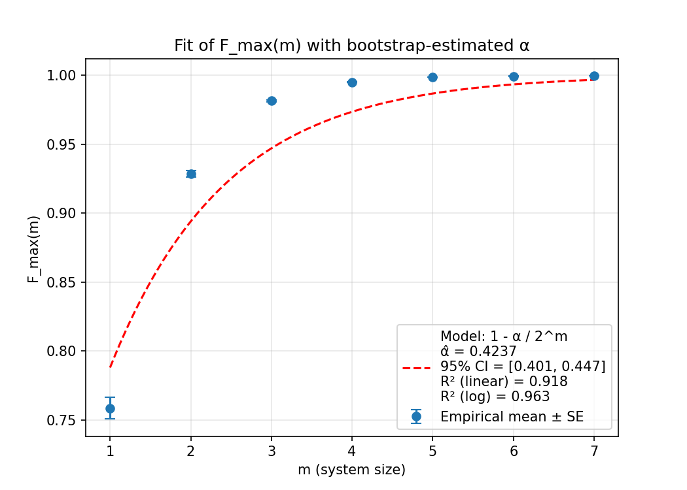

```markdown
# Operational Quantum Foundations: Reproducibility Package

[](https://doi.org/10.5281/zenodo.17139825)
[](https://opensource.org/licenses/MIT)
[](https://www.python.org/downloads/)

This repository contains the complete replication package for the study:

> **Khomyakov, Vladimir (2025). Operational Quantum Foundations: Relational Quantum Mechanics and the Principle of Finite Informational Alignment for Subjective Physics.**
> - **Version-specific DOI:** [10.5281/zenodo.17139825](https://doi.org/10.5281/zenodo.17139825)
> - **Concept DOI (latest version):** [10.5281/zenodo.17139824](https://doi.org/10.5281/zenodo.17139824)

## Theoretical Overview

This work synthesizes **Relational Quantum Mechanics (RQM)** with the **Principle of Finite Informational Capacity** to provide an operational foundation for quantum mechanics. The framework resolves key paradoxes (e.g., Wigner's Friend) by introducing **R-events** as the fundamental relational units of interaction between finite-capacity observers. Classical objectivity emerges via a **percolation of agreement** mechanism in networks of observers, modeled mathematically through bootstrap percolation on interaction graphs.

The computational study herein implements a quantum state tracking task where two independent observers with finite memory (`m` bits) sequentially measure a qubit. The core quantitative result is the scaling relation of the maximum achievable fidelity between the observers' estimates:
$$F_{\max}(m) \approx 1 - \frac{\alpha}{2^m}$$
where $\alpha$ is a constant estimated via bootstrap inference.

## Repository Structure

```
operational-quantum-foundations/
│
├── 📄 README.md # This file
├── ⚙️ requirements.txt # Pinned Python dependencies (pip)
├── ⚙️ environment.yml # Pinned environment (conda)
│
├── 📂 scripts/ # Main analysis scripts
│ ├── monte_carlo_simulation_particle_filter.py # Core simulation: Particle Filter for quantum state tracking
│ └── fit_alpha_bootstrap_replicates.py # Bootstrap estimation of α
│
├── 📂 figures/ # Output directory (generated by scripts)
│ ├── fidelity_convergence.pdf # Plot: Fidelity vs. Measurements
│ ├── alpha_fit_plot.pdf # Plot: F_max(m) with model fit
│ ├── alpha_bootstrap_replicates_hist.pdf # Plot: Bootstrap distribution of α
│ ├── fidelity_results.csv # Raw fidelity data (all trials)
│ ├── plateau_estimates.csv # Mean plateau fidelity per m
│ ├── plateau_estimates_raw.csv # Trial-level plateau fidelity (for bootstrap)
│ ├── alpha_bootstrap_summary.json # Summary stats (α, CI, R²)
│ └── alpha_bootstrap_replicates_samples.csv # Raw bootstrap samples
│
└── 📂 assets/ # Supplementary assets (optional)
  └── readme_plots/ # Example plots for this README

```

## Complete Reproducibility Checklist

To exactly replicate the results from the manuscript:

1.  **Environment:** Create a clean Python environment using the provided `requirements.txt` or `environment.yml`.
2.  **Simulation:** Run `monte_carlo_simulation_particle_filter.py` with the exact command below. This generates the primary dataset (`plateau_estimates_raw.csv`).
3.  **Inference:** Run `fit_alpha_bootstrap_replicates.py` on the generated data to perform bootstrap estimation of α.
4.  **Validation:** Compare the output figures and summary statistics (e.g., `alpha_bootstrap_summary.json`) against those in the `figures/` folder and the manuscript.

## Installation & Dependencies

The code requires **Python 3.9+** and the following packages are pinned for exact reproducibility:

### Using pip

```bash
# Create a virtual environment (recommended)
python -m venv venv
source venv/bin/activate  # On Windows: venv\Scripts\activate
```

```bash
# Install pinned dependencies
pip install -r requirements.txt
```

requirements.txt:

```text
numpy==2.0.2
scipy==1.13.1
scikit-learn==1.6.1
matplotlib==3.9.4
pandas==2.3.1
```

### Using conda

```bash
# Create and activate the environment from the .yml file
conda env create -f environment.yml
conda activate RQM-SF
```

environment.yml:

```yaml
name: RQM-SF
channels:
  - conda-forge
  - defaults
dependencies:
  - python=3.9
  - numpy=2.0.2
  - scipy=1.13.1
  - scikit-learn=1.6.1
  - matplotlib=3.9.4
  - pandas=2.3.1
```

## Usage

All commands should be run from the root directory of the repository (`operational-quantum-foundations/`).

## Step 1: Run the Monte Carlo Simulation
This script simulates two observers estimating a qubit state under finite memory constraints using a Bayesian particle filter.

### Command:

```bash
python scripts/monte_carlo_simulation_particle_filter.py --m_list 1 2 3 4 5 6 7 --n_max 3000 --trials 1000 --update_mode particle --particles 2048 --measure_protocol same
```

**Flags:**

- `--m_list`: Memory sizes (in bits) to simulate.
- `--n_max`: Number of measurements per trial.
- `--trials`: Number of independent Monte Carlo trials for statistical averaging.
- `--update_mode particle`: Use the particle filter algorithm.
- `--particles 2048`: Number of particles in the filter.
- `--measure_protocol same`: Both observers use the same randomly chosen measurement basis (X, Y, or Z) for each measurement.

**Outputs** (`./figures/`):

- `fidelity_results.csv`: Average fidelity (across trials) between observers A and B for every measurement step `n` and memory size `m`.
- `plateau_estimates.csv`: The mean asymptotic fidelity $F_{\max}(m)$ for each `m`, averaged over trials.
- `plateau_estimates_raw.csv`: The asymptotic fidelity for each individual trial, crucial for bootstrap resampling.
- `fidelity_convergence.pdf`: Plot showing the convergence of fidelity for different `m`.

## Step 2: Perform Bootstrap Inference for α

This script estimates the constant $\alpha$ and its confidence interval by resampling the trial-level data.

**Command:**

```bash
python scripts/fit_alpha_bootstrap_replicates.py --boots 5000
```

**Flags:**

- `--boots`: Number of bootstrap replicates (5000 used for the publication).

**Outputs** (`./figures/`):

- `alpha_bootstrap_replicates_hist.pdf`: Histogram of the bootstrap distribution for $\alpha$ with summary statistics.
- `alpha_bootstrap_replicates_samples.csv`: Raw values of $\alpha$ from all bootstrap replicates.
- `alpha_bootstrap_summary.json`: Structured summary of the results.

```json
{
  "alpha_hat": 0.4237,
  "ci_low": 0.4008,
  "ci_high": 0.4471,
  "r2_linear": 0.9178,
  "r2_log": 0.9633,
  "n_boot": 5000,
  "seed": 42
}
```
- `alpha_fit_plot.pdf`: Plot of the empirical $F_{\max}(m)$ values with the fitted model $1 - \alpha/2^m$.



*Example of the model fit. Dots represent empirical $F_{\max}(m)$ values, the dashed line shows the fitted model $1 - \alpha/2^m$. The estimated $\alpha$ and its confidence interval are shown in the legend.*

## Output Interpretation & Replication Validation

- **Fidelity Convergence**: The plot `fidelity_convergence.pdf` should show that for larger memory `m`, the fidelity between observers converges to a higher value, plateauing closer to 1. This visually demonstrates the effect of finite informational capacity.

- **Bootstrap Result**: A successful replication will yield a bootstrap estimate for $\alpha$ ( `alpha_hat` in the JSON summary) that is approximately **0.42**, with a 95% confidence interval roughly between **0.40** and **0.45**. The high $R^2$ values indicate a good fit of the scaling model.

- **Percolation Threshold**: The mathematical connection between the finite-information model and percolation theory (explored analytically in the paper) is validated by this quantitative result, showing that objectivity (high fidelity) emerges predictably as a function of memory capacity.

## Citation

If you use this code or the accompanying ideas in your work, please cite:

```bibtex
@misc{khomyakov_2025_17139825,
  author       = {Khomyakov, Vladimir},
  title        = {Operational Quantum Foundations: Relational
                  Quantum Mechanics and the Principle of Finite
                  Informational Alignment for Subjective Physics},
  month        = sep,
  year         = 2025,
  publisher    = {Zenodo},
  version      = {1.0},
  doi          = {10.5281/zenodo.17139825},
  url          = {https://doi.org/10.5281/zenodo.17139825}
}
```

## License

This reproducibility package is licensed under the MIT License. See the LICENSE file for details.

## Contributing

While this repository is primarily intended to ensure the reproducibility of a specific study, suggestions and corrections are welcome. Please open an Issue or Pull Request on GitHub.
```